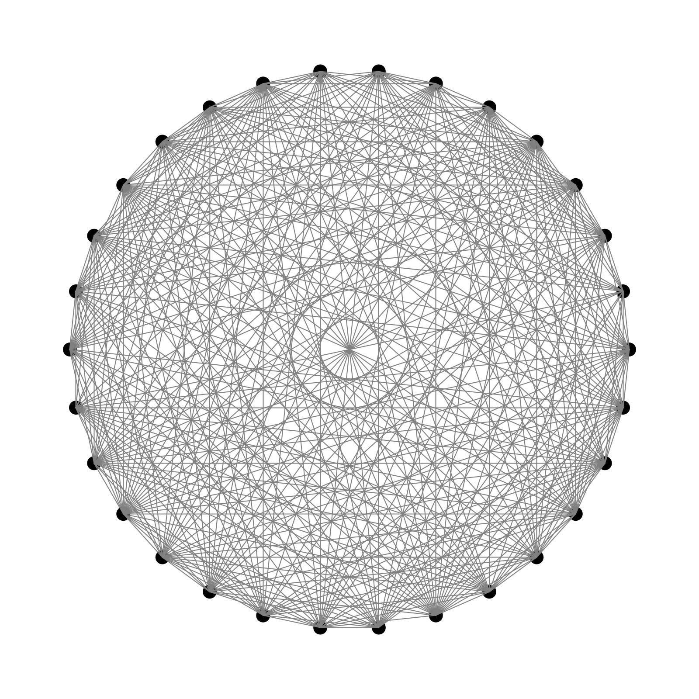

# Fundamentals - Basic Programming Model

## Newton Raphson method

This method is used to estimate a solution to the equation $ f(x) = 0 $

Algorithm:

1. Guess a first approximation to a solution of the equation $ f(x) = 0 $ . Graph may help.
2. Use the first approximation to get the next approximation

$
x_{n+1} = x_n - \frac{f(x_n)}{f'(x_n)}
$

For square root we use $ x^2-c = 0$

## Binary Search

Iterative form of binary search

## GCD

GCD of 2 numbers using Euclid's algorithm

## Histogram

Constructing a histogram using algs4 library

## Random Connections

Plot of N equally spaced dots of size .05 on the circumference of a circle, and then, with probability p for each pair 
of points, draws a gray line connecting them. This was a beautiful picture.

