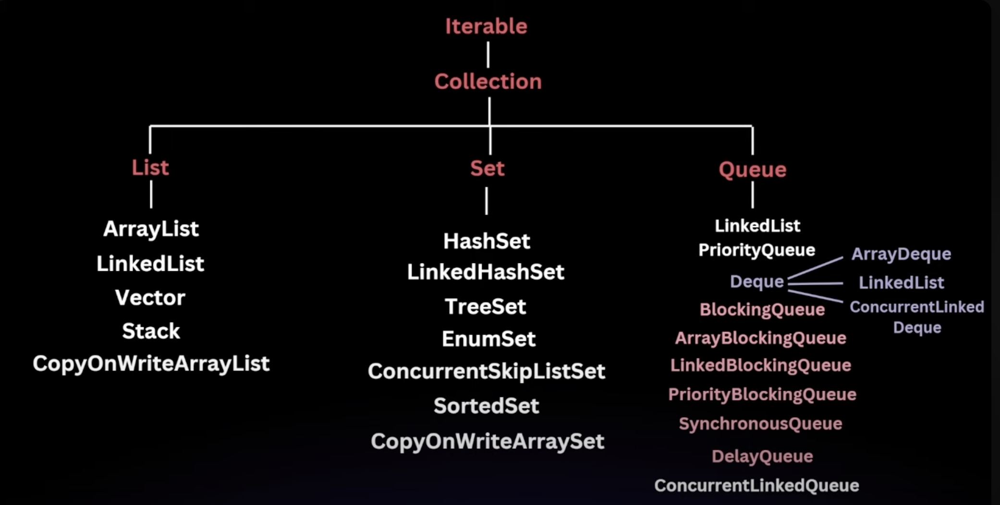

# Java Collections

The collection framework is organized into a hierarchy where the core interfaces are at the top, and the specific 
implementations extend these interfaces.

- Collection : The root interface for all the other collection types.
- List : An ordered collection that can contain duplicate elements(e.g., ArrayList, LinkedList)
- Set : A collection that cannot contain duplicate elements (e.g., HashSet, TreeSet)
- Queue : A collection designed for holding elements prior to processing(e.g., PriorityQueue, LinkedList)
- Deque : A double ended queue that allows insertion and removal from both ends(e.g., ArrayDeque) //pronounced dek
- Map : An interface that represents a collection of key-value pairs (e.g., HashMap, TreeMap)

