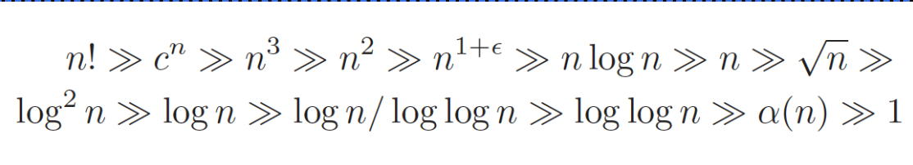
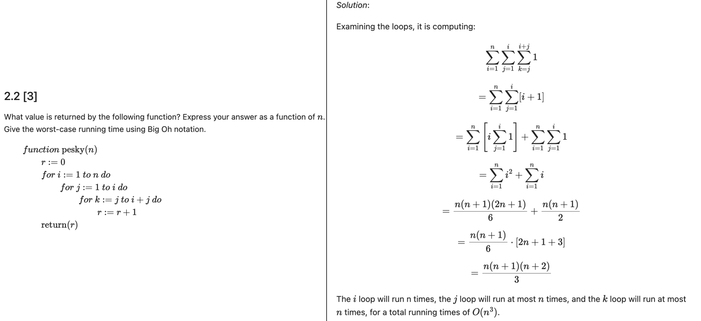

# Growth of functions

## Asymptotic Notations

- Big O : f(n) = O(g(n)) means f(n) <= c.g(n) , asymptotic upper bound or worst case
- Big Omega : f(n) = Ω(g(n)) means f(n) ≥ c.g(n) for all n ≥ n0 , lower bound
- Big Theta : f(n) = Θ(g(n)) means c2.g(n)<= f(n) <=c1·g(n)  for all n ≥ n0. , tight bound

## Algebra of asymptotic notations

- f(n)+g(n) -> O(max(f(n),g(n)))
- O(c · f(n)) → O(f(n))
- O(f(n)) · O(g(n)) → O(f(n) · g(n))
- If f(n) = O(g(n)) and g(n) = O(h(n)), then f(n) = O(h(n))

## Loop analysis

