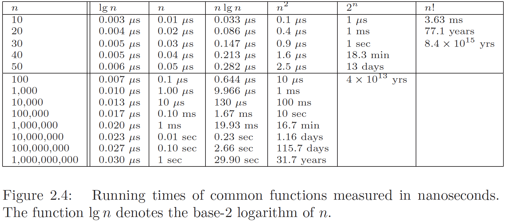

# Ch2 Algorithm Analysis

Algorithms are the most important and durable part of computer science because
they can be studied in a language- and machine-independent way.

## RAM model of Computation

Machine-independent algorithm design depends upon a hypothetical computer
called the Random Access Machine, or RAM model of computation where,

- Each simple operation(+,*,-,=,if,call) takes exactly one time step.
- Loops and subroutines are not considered simple operations.
- Each memory access takes exactly one time step. Furthermore, we have
	as much memory as we need. The RAM model takes no notice of whether
	an item is in cache or on the disk.

## Best-Case,Worst-Case, and Average-Case Complexity

The Big Oh notation enables us to ignore details and focus on the big picture.

The Big Oh notation ignores the difference between multiplicative constants.
The functions f(n) = 2n and g(n) = n are identical in Big Oh analysis. This
makes sense given our application. Suppose a given algorithm in (say) C language
ran twice as fast as one with the same algorithm written in Java. This
multiplicative factor of two can tell us nothing about the algorithm itself, because
both programs implement exactly the same algorithm. We should ignore
such constant factors when comparing two algorithms.

### Big O

The worst-case complexity(upper bound) of the algorithm is the function defined by the
maximum number of steps taken in any instance of size n. 
f(n) = O(g(n)) means There exists some constant c such that 
f(n) ≤ c · g(n) for every large enough n.

### Big Omega

The best-case complexity(lower bound) of the algorithm is the function defined by the
minimum number of steps taken in any instance of size n. 
f(n) = Ω(g(n)) means there exists some constant c such that 
f(n) ≥ c.g(n) for all n ≥ n0.

### Big Theta

The average-case complexity(tight bound) or expected time of the algorithm, which is
the function defined by the average number of steps over all instances of
size n.
There exist constants c1 and c2 such that 
c2.g(n)<= f(n) <=c1·g(n)  for all n ≥ n0.

## Running times of common functions

Below figure shows how long algorithms that use f(n) operations
take to run on a fast computer, where each operation costs one nanosecond
(10−9 seconds). The following conclusions can be drawn from this table:
- All such algorithms take roughly the same time for n = 10.
- Any algorithm with n! running time becomes useless for n ≥ 20.

)